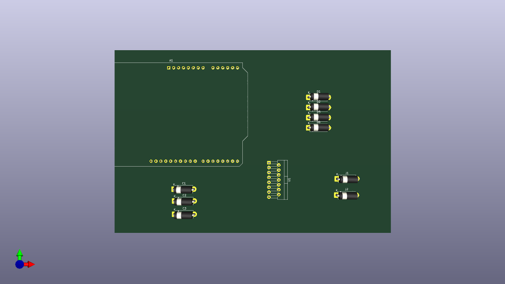

# Automobile Copilot - Power & Motor Control System

This repository contains the hardware design files for an **Automobile Copilot System**. The project focuses on creating a reliable power management and motor actuation layer, specifically designed to handle the electrical environment of a vehicle.

## 📌 Project Overview
As a Computer Engineering student at Istanbul Sabahattin Zaim University, I developed this circuit to bridge the gap between high-level software logic and physical vehicle actuators. The board ensures clean power delivery to an Arduino Uno and provides safe control for DC motors.

## 🛠 Technical Specifications
- **Voltage Input:** +12V DC (Automotive battery compatible).
- **Voltage Regulation:** Integrated **LM2596** Switching Regulator (12V to 5V conversion).
- **Motor Driver:** **L298HN** Dual H-Bridge for bidirectional motor control.
- **Protection Circuits:**
  - **SMBJ16A TVS Diode:** Protects against transient voltage spikes common in vehicles.
  - **UF4007 Ultra-Fast Diodes:** Flyback protection against inductive back-EMF.
  - **Fused Input:** Integrated 1-2A fuse for overcurrent protection.

## 📂 File Structure
- [📄 Download Schematic PDF](https://github.com/betulsenyil/Automobile-Copilot-Hardware/blob/main/Copilot_Power_Motor_Board.kicad_pcb.pdf)
- `Copilot_Power_Motor_Board.kicad_sch`: Schematic source file.
- `Copilot_Power_Motor_Board.kicad_pcb`: Printed Circuit Board (PCB) layout source file.
- `Copilot_Power_Motor_Board.kicad_pro`: KiCad project management file.

## 🚀 Technologies Used
- **Design Tool:** KiCad 9.0
- **Microcontroller:** Arduino Uno R3
- **Main Components:** LM2596, L298HN, TVS Protection.

## 📋 Future Work
- Integration of a CAN-Bus shield for vehicle data communication.
- Implementation of GPS and IMU sensors for co-pilot navigation logic.
- Development of the AI-driven co-pilot software in Python/C++.

---
*Developed by F. Betül Şenyıl*
